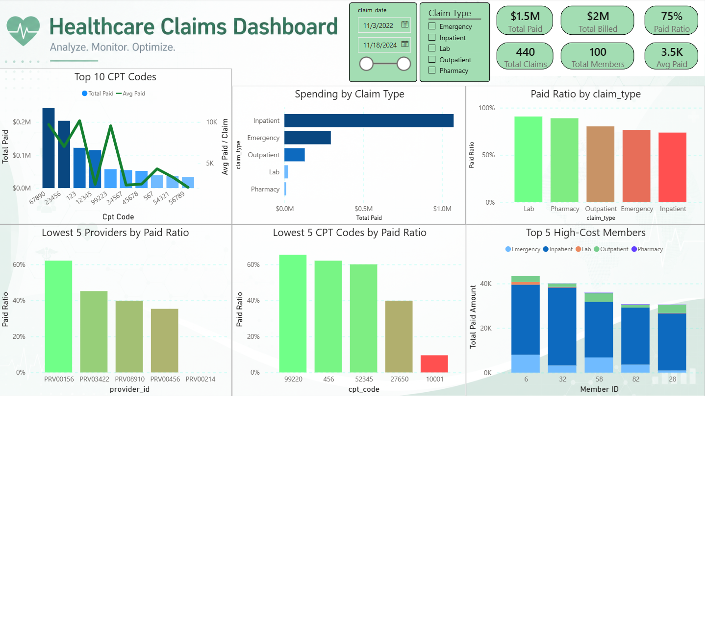
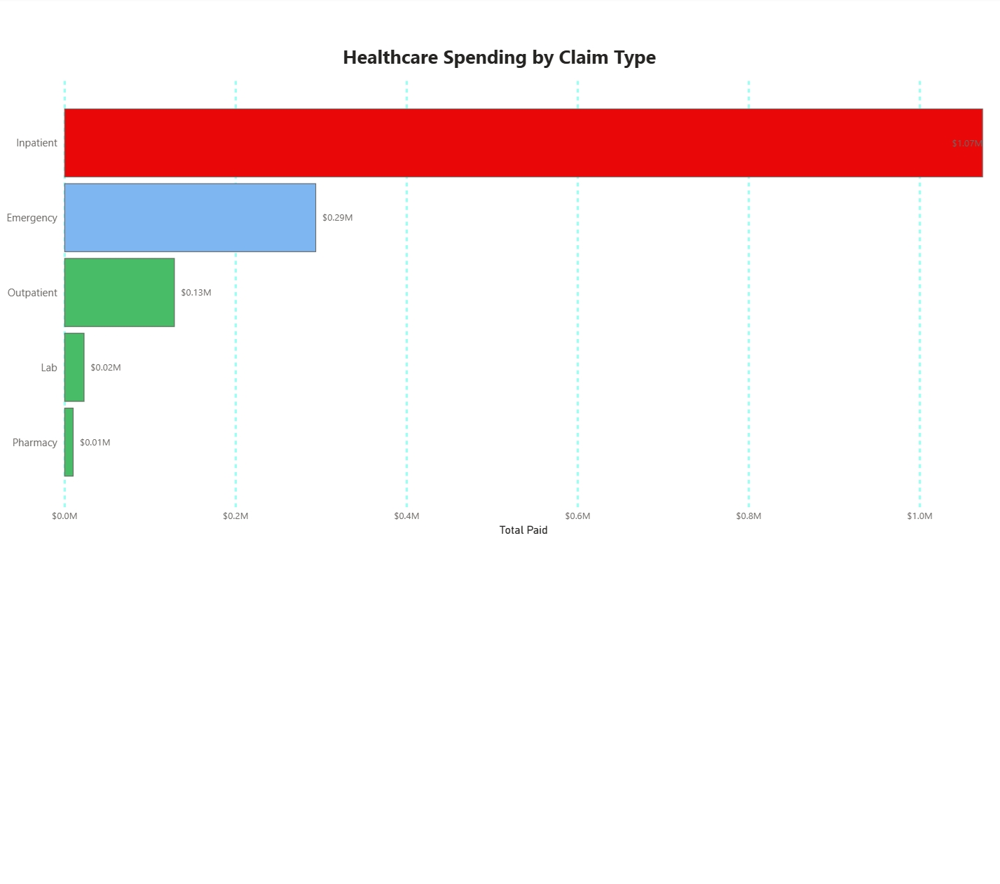
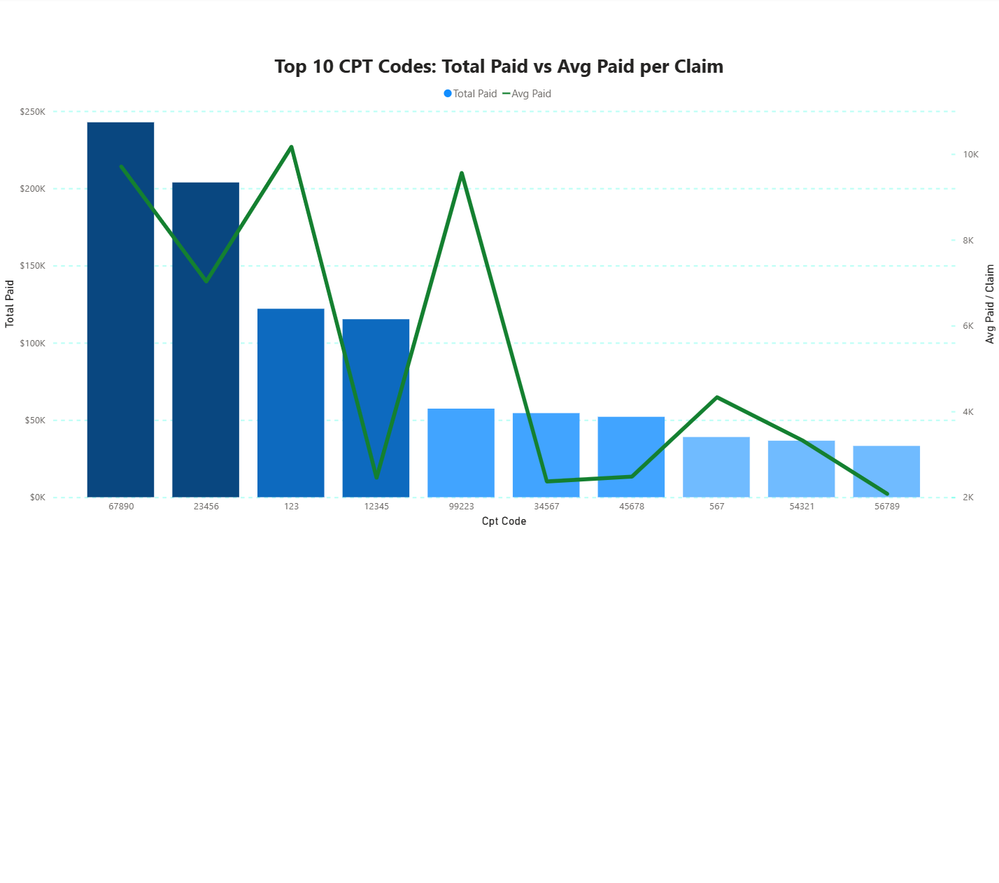
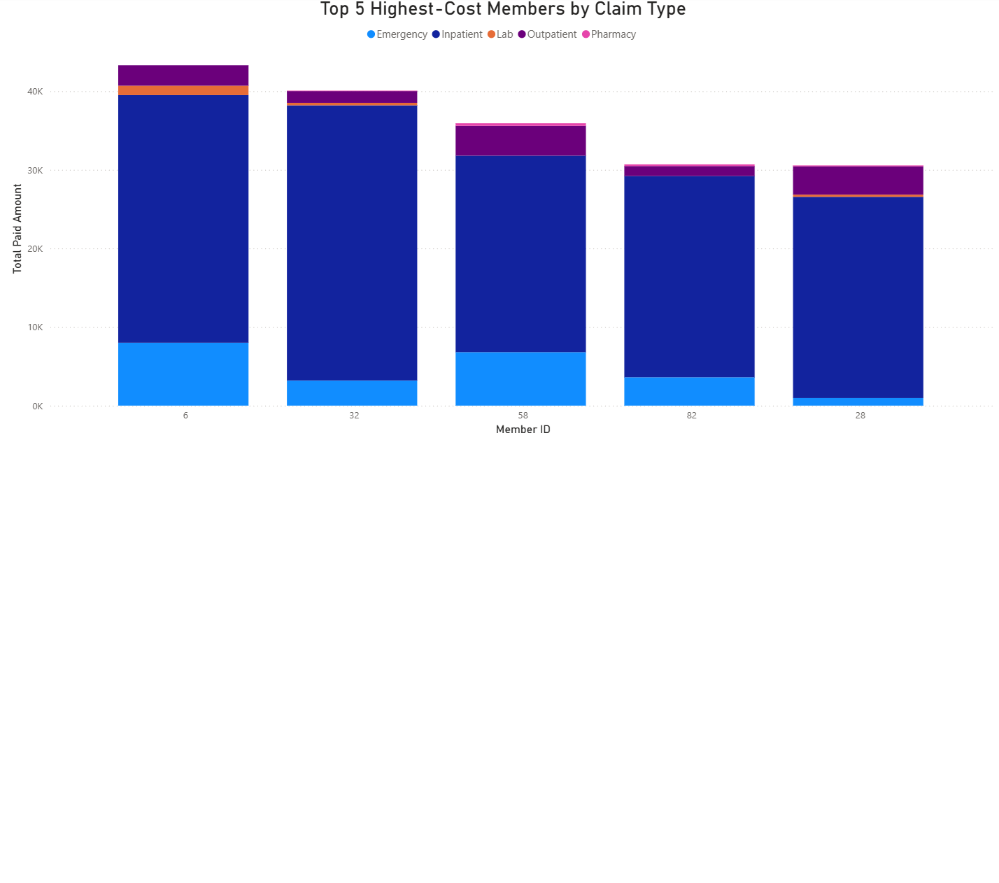

# 🏥 Healthcare Claims Dashboard | Power BI & SQL

## 📌 Project Overview

Healthcare insurance companies process thousands of medical claims every year. Understanding where healthcare spending is concentrated is essential for improving profitability, optimizing reimbursement policies, and supporting data-driven decision-making.

This project demonstrates an end-to-end healthcare analytics workflow, starting with SQL data cleaning and business analysis, followed by an interactive Power BI dashboard designed for executive reporting.

The dashboard identifies the major cost drivers across claim types, CPT procedures, providers, and members while analyzing reimbursement efficiency using Paid Ratio.

---

# 🎯 Business Problem

The insurance company wants to answer the following questions:

- Which claim types generate the highest healthcare costs?
- Which CPT procedures drive the highest spending?
- Which members account for the largest share of total costs?
- How do billed amounts compare to paid amounts?
- Which providers or procedures have unusually low reimbursement rates?

---

# 🛠 Tools & Technologies

- SQL
- Power BI
- Power Query
- DAX
- Excel

---

# 🗄 SQL Data Preparation & Business Analysis

Before building the dashboard, the dataset was cleaned and analyzed using SQL.

### Data Cleaning

- Removed duplicate records
- Checked data quality
- Standardized date fields
- Validated billed and paid amounts
- Prepared the dataset for reporting

### Business Analysis

SQL was used to answer the project's business questions by:

- Ranking claim types by total paid amount
- Identifying the top CPT codes by healthcare spending
- Calculating average paid amount per claim
- Identifying the highest-cost members
- Calculating Paid Ratio
- Comparing reimbursement across claim types, providers, and CPT codes

The analysis makes use of:

- Common Table Expressions (CTEs)
- Window Functions
- Aggregate Functions
- Ranking Functions
- Date Functions
- CASE Statements

---

# 📊 Analytics Workflow

```
Raw Dataset
      │
      ▼
SQL Data Cleaning
      │
      ▼
SQL Business Analysis
      │
      ▼
Power BI Data Modeling
      │
      ▼
Interactive Dashboard
      │
      ▼
Business Insights
```

---

# 📄 Dashboard Pages

## 1. Executive Dashboard

Provides a high-level overview of:

- Total Paid Amount
- Total Billed Amount
- Paid Ratio
- Total Claims
- Total Members
- Average Paid per Claim

---

## 2. Claim Type Analysis

Compares healthcare spending by claim type using:

- Total Paid
- Total Billed
- Number of Claims

---

## 3. CPT Analysis

Analyzes:

- Top CPT Codes by Total Paid
- Average Paid per Claim
- High-cost medical procedures

---

## 4. Member Analysis

Identifies:

- Top 5 Highest-Cost Members
- Spending breakdown by Claim Type

---

## 5. Paid Ratio Analysis

Evaluates reimbursement efficiency across:

- Claim Types
- Providers
- CPT Codes

using:

**Paid Ratio = Paid Amount ÷ Billed Amount**

This page helps identify providers and procedures with unusually low reimbursement rates.

---

# 📈 Key Insights

- The top 5 CPT codes account for approximately **50%** of the total paid spending, highlighting a strong concentration of healthcare costs.

- Some providers had paid ratios below **20%**, indicating unusually low reimbursement levels that may require further investigation.

- Lab and Pharmacy claims had the highest average paid ratios during the analyzed period.

- Between 2023 and 2024, total payments for Emergency claims increased significantly. Afterward, Emergency spending declined while Inpatient claims became the primary cost driver.

- CPT codes **67890**, **123**, and **23456** contributed the largest share of total paid spending despite having relatively few claims, indicating that these procedures are particularly expensive.

- The top five highest-cost members generated most of their healthcare spending through Inpatient claims.

- CPT code **10001** had the lowest paid ratio (below 20%), indicating unusually low reimbursement compared with its billed amount and suggesting that this procedure may require further investigation.

- Although Inpatient claims accounted for the highest total healthcare spending, they had the lowest average paid ratio among all claim types.

---

# 💼 Business Value

This dashboard helps healthcare executives:

- Identify major healthcare cost drivers
- Monitor reimbursement efficiency
- Detect unusually low paid ratios
- Review expensive medical procedures
- Monitor high-cost members
- Support data-driven financial decision-making

---

# 📁 Repository Structure

```
Healthcare Claims Dashboard
│
├── Dashboard.pbix
├── SQL
│   ├── data_cleaning.sql
│   └── healthcare_claims_analysis.sql
├── Images
├── Dataset
└── README.md
```

---

# 📷 Dashboard Preview

### Executive Dashboard



### Claim Type Analysis



### CPT Analysis



### Member Analysis



### Paid Ratio Analysis


---

## 👨‍💻 Author

**Parsa Sotoodeh**

If you found this project useful, feel free to ⭐ the repository.


# Test


